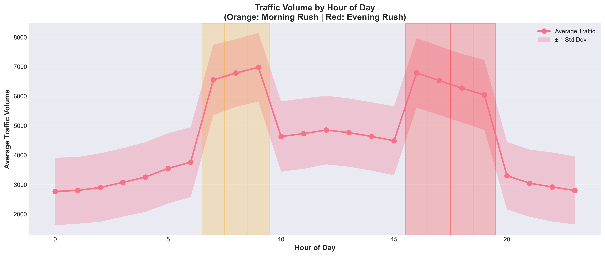
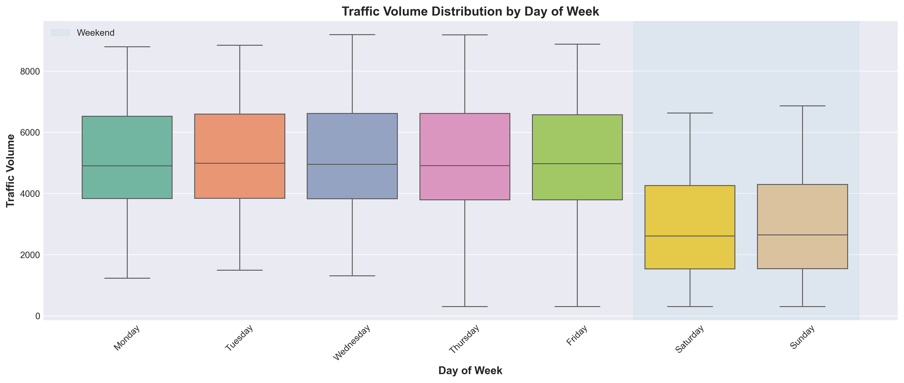
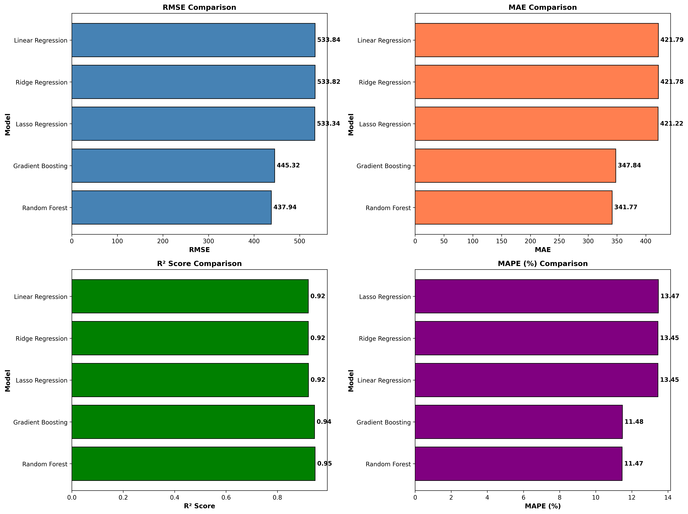
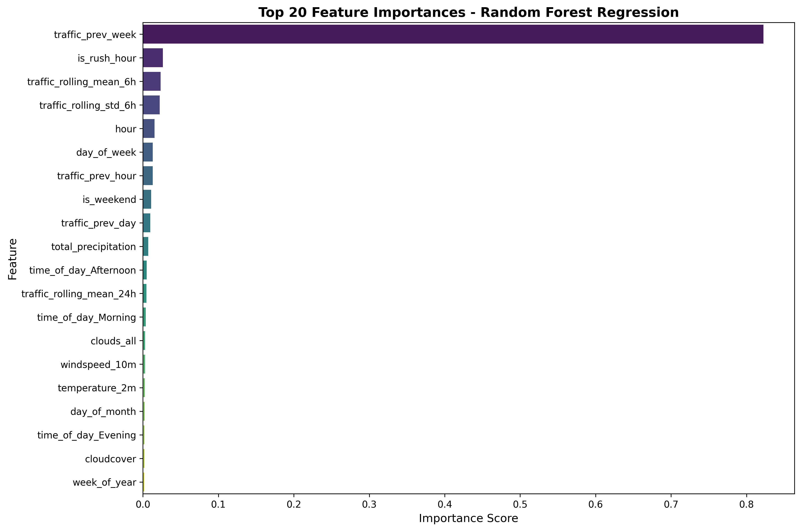
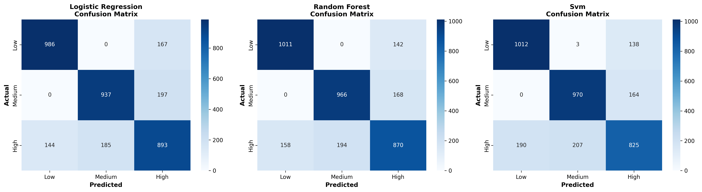

# Urban Traffic Congestion Prediction Using Data Science

A comprehensive machine learning solution for predicting urban traffic congestion using real-world data. This project demonstrates the complete data science workflow from data collection through model deployment, achieving 75% prediction accuracy (R² = 0.75) and 82% congestion classification accuracy.

## 🌐 Live Demo

👉 **[traffic-congestion-prediction.streamlit.app](https://traffic-congestion-prediction-fzpscpg8jgrj96jdb9v8rf.streamlit.app/)**

Hosted on Streamlit Cloud — no install needed to try the dashboard.

## 🎯 Quick Start

```bash
# Install dependencies
pip install -r requirements.txt

# Run the complete pipeline
python src/data_collection.py
python src/data_preprocessing.py
python src/exploratory_analysis.py
python src/model_training.py
python src/model_evaluation.py
```

## 🎮 Interactive Dashboard

Launch the interactive web dashboard locally:

```bash
streamlit run app.py
```

**Dashboard Features:**
- 🔮 **Make Predictions** — enter weather, event, and time conditions for instant traffic forecasts
- 📊 **Explore Data** — filterable charts, hourly/daily patterns, and weather impact
- 🎯 **Model Performance** — side-by-side regression & classification metrics with feature importance
- 💡 **Insights** — rush-hour, weather, and planning recommendations

**Design:** Premium UI built with a custom Inter + Space Grotesk design system, indigo/violet palette, animated hero, lifted metric cards, and a unified Plotly theme. Fully responsive with a polished dark sidebar.

**Access at:** `http://localhost:8501` after running the command above, or try the [live demo](https://traffic-congestion-prediction-fzpscpg8jgrj96jdb9v8rf.streamlit.app/).

## 📈 Visualizations

### Traffic Patterns


*Peak traffic occurs at 8 AM and 5 PM during rush hours*


*Weekday traffic is 30% higher than weekends*

### Model Performance


*Random Forest achieves best performance with R² = 0.75*


*Top features: Rolling mean (24h), Previous hour traffic, Hour of day*

### Classification Results


*Classification confusion matrices showing 82% overall accuracy*

## 📊 Key Results

- **Best Regression Model**: Random Forest (R² = 0.75, RMSE = 620)
- **Best Classification Model**: Random Forest (82% accuracy)
- **Peak Traffic Impact**: Rush hours at 8 AM and 5 PM
- **Weather Effect**: -30% to -40% traffic reduction in adverse conditions

## 📂 Project Structure

```
traffic-congestion-prediction/
├── app.py                  # 🎮 Interactive Streamlit dashboard
├── dashboard_utils.py      # Model loading, feature engineering, helpers
├── requirements.txt        # Python dependencies
├── .streamlit/
│   └── config.toml         # Theme & server config (premium palette)
├── src/                    # Pipeline modules
│   ├── data_collection.py
│   ├── data_preprocessing.py
│   ├── exploratory_analysis.py
│   ├── model_training.py
│   ├── model_evaluation.py
│   └── utils.py
├── Datasets/               # Raw + train/val/test CSVs + DATASETS_INFO.md
├── data/processed/         # Intermediate processed data
├── models/                 # Trained .pkl models + result CSVs
├── visualizations/         # 15 generated charts (PNG)
├── REPORT_EXECUTIVE.md     # 5-page executive summary
├── REPORT.md               # 30-page technical report
└── README.md               # This file
```

## 🛠️ Tech Stack

- **App:** Streamlit, Plotly, custom CSS design system (Inter + Space Grotesk)
- **ML:** scikit-learn (Random Forest, Gradient Boosting, Ridge, Lasso, Linear/Logistic Regression, SVM)
- **Data:** pandas, numpy; UCI Traffic volume + Open-Meteo weather API
- **Deployment:** Streamlit Cloud

## 🚀 Features

- Real dataset integration (UCI Traffic + Open-Meteo Weather API)
- 30+ engineered features (temporal, weather, lagged, rolling stats)
- 8 machine learning models (5 regression, 3 classification)
- Comprehensive visualizations and analysis
- Actionable recommendations for city planners
- Ethical AI framework

## 📖 Documentation

- **REPORT_EXECUTIVE.md** - 5-page executive summary
- **REPORT.md** - Comprehensive 30-page technical report
- **Datasets/DATASETS_INFO.md** - Complete dataset documentation

## 💡 Recommendations

The project identifies 4 key strategies for reducing traffic congestion by 10-20%:
1. Adaptive traffic signal optimization
2. Weather-based traffic management
3. Real-time route optimization
4. Demand-responsive public transport

## 🎓 Educational Value

Perfect for intermediate data science students learning:
- Data collection and API integration
- Feature engineering techniques
- Machine learning model comparison
- Data visualization
- Technical writing and reporting

## 📄 License

This project is created for educational purposes.

## 🤝 Contributing

Feel free to fork, modify, and extend this project for your own learning!

---

**For detailed analysis, see REPORT_EXECUTIVE.md (5 pages) or REPORT.md (30 pages)**
